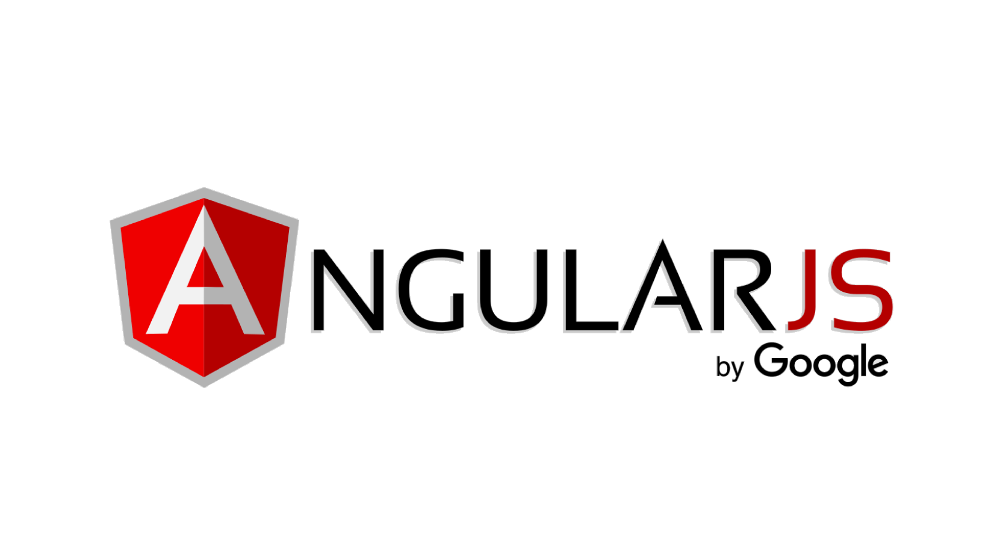

## Java 8 Spring Boot Maven API using Clean Architecture  

#### Project Update  

Added Angular 8 Web UI project to access .Net API.  

  

This solution consists of an Angular Web UI and Java 8 API including tests developed using Clean Architecture principles. The solution contains the Web, Api, Infrastructure, Core, and Test projects. The Infrastructure project utilizes Hibernate ORM with a Repository pattern for data access using JPA. Logging is implemented using Apache Log4j2.

Swagger has also been implemented. To view the Swagger endpoints, jump to *[host url:port]/swagger-ui.html* Also, the SQL scripts to create the database tables are included in the *"docs"* folder.  

Clean Architecture in this example is obtained through the implementation of SOLID design principles:  

* Separation of Concerns/Single Responsibility: Api, Infrastructure (Data Access), Core(Domain models, service & repository interfaces)
* Dependency Inversion Principle: All concrete class packages connect only through abstractions (interface or abstract class packages ) 
* Explicit Dependencies Principle: All dependencies requested via constructor (except Serilog)  

## Project Structure  

* The Web project contains the Angular web user interface.
* The Api project contains the REST endpoints, services, log files, CORS filter, DTO models, & configuration.  
* The Infrastructure project contains the JPA repository extensions.  
* The Core project contains the business domain entities, exception objects, and JPA repository interface.  

  
Clean Architecture Diagram

From the diagram above, the api & infrastructure projects depend on the core project; all dependencies point inward to the core project. Inner projects define interfaces, outer projects implement the interfaces. None of the projects reference outward-positioned projects - inward references only. The Angular web project does not depend on other projects in this solution. It is a seperate project which hits the REST endpoints in the Java Api project. The Java Api runs as a Spring Boot microservice. The Angular project runs seperately from the Api.

1.) The Angular UI project (not pictured above; would be outer-most layer) hits the Java Api project REST endpoints.  
2.) The Api project has references to the Infrastructure and Core projects.  
3.) The Infrastructure project only references the Core project.  
4.) The Core project has no other project references.  

## Prerequisites

Angular (8) with Bootstrap (4.4.1)   
Gson (2.8.6)    
H2 (1.4.2)  
Hibernate (5.4.9.Final)  
Java (jre1.8.0_231)    
JUnit (4.12)      
ModelMapper (2.3.6)  
Spring Boot (2.2.2)   
Spring Boot Starter JPA (2.2.2)          
Spring Boot Starter Log4j2 (2.2.2)   
Swagger (2.9.2)     

## Installing & running Api project locally

1.) Clone or download the project  
2.) Open the solution in Eclipse
3.) Clean & build the solution  
4.) Run the Java Api project then run the Angular Web project
5.) The Swagger implementation can be veiwed at: *[host url]/swagger-ui.html*  

## Running the Angular project locally  

1.) With the Api project running locally, right-click on the Angular *web* project click "Run As* >>> *Angular Web Application*  
2.) A browser window will open to the Angular UI  

## Running the tests

To run all of the Api solution tests, right-click the *"com.clean.architecture.api.tests"* package >>> *Run as JUnit Test*

## Test Composition

There are two types of tests included in the solution. These tests use an in-memory database (H2) for tests. Here is the test breakdown:

1.) Repository Integration Tests: Tests the implementations of Jpa data repositories.  
2.) Functional Tests: Tests the Api REST controllers.  

## Built With

* Eclipse STS 4.5
* MSSQL Server 2017  

## Demo Link  

<a href="https://cleanarchitecturewebapp.azurewebsites.net/" target=blank>https://cleanarchitecturewebapp.azurewebsites.net/</a>  (.Net version)

## Disclaimer

This solution is provided as a simple implementation of clean architecture using Java/Spring/Maven & Angular. It is not meant to be used in any environment other than a development environment for learning purposes. By downloading, cloning, or any other means of implementing this solution, you agree to indemnify the author of all liability resulting from the use of this code.

## Author

* **Skip Gregory** - https://github.com/sgregory32

